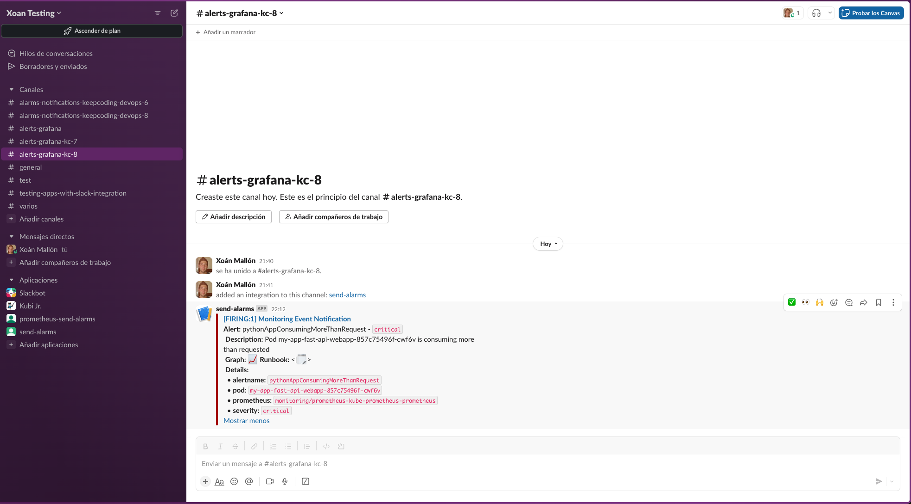

# keepcoding-devops-liberando-productos-practica-final

## Objetivo

El objetivo es mejorar un proyecto creado previamente para ponerlo en producción, a través de la adicción de una serie de mejoras.

## Proyecto inicial

El proyecto inicial es un servidor que realiza lo siguiente:

- Utiliza [FastAPI](https://fastapi.tiangolo.com/) para levantar un servidor en el puerto `8081` e implementa inicialmente dos endpoints:
  - `/`: Devuelve en formato `JSON` como respuesta `{"health": "ok"}` y un status code 200.
  - `/health`: Devuelve en formato `JSON` como respuesta `{"message":"Hello World"}` y un status code 200.

- Se han implementado tests unitarios para el servidor [FastAPI](https://fastapi.tiangolo.com/)

- Utiliza [prometheus-client](https://github.com/prometheus/client_python) para arrancar un servidor de métricas en el puerto `8000` y poder registrar métricas, siendo inicialmente las siguientes:
  - `Counter('server_requests_total', 'Total number of requests to this webserver')`: Contador que se incrementará cada vez que se haga una llamada a alguno de los endpoints implementados por el servidor (inicialmente `/` y `/health`)
  - `Counter('healthcheck_requests_total', 'Total number of requests to healthcheck')`: Contador que se incrementará cada vez que se haga una llamada al endpoint `/health`.
  - `Counter('main_requests_total', 'Total number of requests to main endpoint')`: Contador que se incrementará cada vez que se haga una llamada al endpoint `/`.

## Software necesario

Es necesario disponer del siguiente software:

- `Python` en versión `3.8.5` o superior, disponible para los diferentes sistemas operativos en la [página oficial de descargas](https://www.python.org/downloads/release/python-385/)

- `virtualenv` para poder instalar las librerías necesarias de Python, se puede instalar a través del siguiente comando:

    ```sh
    pip3 install virtualenv
    ```

    En caso de estar utilizando Linux y el comando anterior diera fallos se debe ejecutar el siguiente comando:

    ```sh
    sudo apt-get update && sudo apt-get install -y python3.8-venv
    ```

- `Docker` para poder arrancar el servidor implementado a través de un contenedor Docker, es posible descargarlo a [través de su página oficial](https://docs.docker.com/get-docker/).

## Ejecución de servidor

### Ejecución directa con Python

1. Instalación de un virtualenv, **realizarlo sólo en caso de no haberlo realizado previamente**:
   1. Obtener la versión actual de Python instalada para crear posteriormente un virtualenv:

        ```sh
        python3 --version
        ```

        El comando anterior mostrará algo como lo mostrado a continuación:ç

        ```sh
            Python 3.8.13
        ```

   2. Crear de virtualenv en la raíz del directorio para poder instalar las librerías necesarias:

       - En caso de en el comando anterior haber obtenido `Python 3.8.*`

            ```sh
            python3.8 -m venv venv
            ```

       - En caso de en el comando anterior haber obtenido `Python 3.9.*`:

           ```sh
           python3.9 -m venv venv
           ```

2. Activar el virtualenv creado en el directorio `venv` en el paso anterior:

     ```sh
     source venv/bin/activate
     ```

3. Instalar las librerías necesarias de Python, recogidas en el fichero `requirements.txt`, **sólo en caso de no haber realizado este paso previamente**. Es posible instalarlas a través del siguiente comando:

    ```sh
    pip3 install -r requirements.txt
    ```

4. Ejecución del código para arrancar el servidor:

    ```sh
    python3 src/app.py
    ```

5. La ejecución del comando anterior debería mostrar algo como lo siguiente:

    ```sh
    [2022-04-16 09:44:22 +0000] [1] [INFO] Running on http://0.0.0.0:8081 (CTRL + C to quit)
    ```

### Ejecución a través de un contenedor Docker

1. Crear una imagen Docker con el código necesario para arrancar el servidor:

    ```sh
    docker build -t simple-server:0.0.1 .
    ```

2. Arrancar la imagen construida en el paso anterior mapeando los puertos utilizados por el servidor de FastAPI y el cliente de prometheus:

    ```sh
    docker run -d -p 8000:8000 -p 8081:8081 --name simple-server simple-server:0.0.1
    ```

3. Obtener los logs del contenedor creado en el paso anterior:

    ```sh
    docker logs -f simple-server
    ```

4. La ejecución del comando anterior debería mostrar algo como lo siguiente:

    ```sh
    [2022-04-16 09:44:22 +0000] [1] [INFO] Running on http://0.0.0.0:8081 (CTRL + C to quit)
    ```

## Comprobación de endpoints de servidor y métricas

Una vez arrancado el servidor, utilizando cualquier de las formas expuestas en los apartados anteriores, es posible probar las funcionalidades implementadas por el servidor:

- Comprobación de servidor FastAPI, a través de llamadas a los diferentes endpoints:

  - Realizar una petición al endpoint `/`

      ```sh
      curl -X 'GET' \
      'http://0.0.0.0:8081/' \
      -H 'accept: application/json'
      ```

      Debería devolver la siguiente respuesta:

      ```json
      {"message":"Hello World"}
      ```

  - Realizar una petición al endpoint `/health`

      ```sh
      curl -X 'GET' \
      'http://0.0.0.0:8081/health' \
      -H 'accept: application/json' -v
      ```

      Debería devolver la siguiente respuesta.

      ```json
      {"health": "ok"}
      ```

- Comprobación de registro de métricas, si se accede a la URL `http://0.0.0.0:8000` se podrán ver todas las métricas con los valores actuales en ese momento:

  - Realizar varias llamadas al endpoint `/` y ver como el contador utilizado para registrar las llamadas a ese endpoint, `main_requests_total` ha aumentado, se debería ver algo como lo mostrado a continuación:

    ```sh
    # TYPE main_requests_total counter
    main_requests_total 4.0
    ```

  - Realizar varias llamadas al endpoint `/health` y ver como el contador utilizado para registrar las llamadas a ese endpoint, `healthcheck_requests_total` ha aumentado, se debería ver algo como lo mostrado a continuación:

    ```sh
    # TYPE healthcheck_requests_total counter
    healthcheck_requests_total 26.0
    ```

  - También se ha credo un contador para el número total de llamadas al servidor `server_requests_total`, por lo que este valor debería ser la suma de los dos anteriores, tal y como se puede ver a continuación:

    ```sh
    # TYPE server_requests_total counter
    server_requests_total 30.0
    ```

## Tests

Se ha implementado tests unitarios para probar el servidor FastAPI, estos están disponibles en el archivo `src/tests/app_test.py`.

Es posible ejecutar los tests de diferentes formas:

- Ejecución de todos los tests:

    ```sh
    pytest
    ```

- Ejecución de todos los tests y mostrar cobertura:

    ```sh
    pytest --cov
    ```

- Ejecución de todos los tests y generación de report de cobertura:

    ```sh
    pytest --cov --cov-report=html
    ```

## Practica a realizar

A partir del ejemplo inicial descrito en los apartados anteriores es necesario realizar una serie de mejoras:

Los requirimientos son los siguientes:

- Añadir por lo menos un nuevo endpoint a los existentes `/` y `/health`, un ejemplo sería `/bye` que devolvería `{"msg": "Bye Bye"}`, para ello será necesario añadirlo en el fichero [src/application/app.py](./src/application/app.py)

- Creación de tests unitarios para el nuevo endpoint añadido, para ello será necesario modificar el [fichero de tests](./src/tests/app_test.py)

- Opcionalmente creación de helm chart para desplegar la aplicación en Kubernetes, se dispone de un ejemplo de ello en el laboratorio realizado en la clase 3

- Creación de pipelines de CI/CD en cualquier plataforma (Github Actions, Jenkins, etc) que cuenten por lo menos con las siguientes fases:

  - Testing: tests unitarios con cobertura. Se dispone de un [ejemplo con Github Actions en el repositorio actual](./.github/workflows/test.yaml)

  - Build & Push: creación de imagen docker y push de la misma a cualquier registry válido que utilice alguna estrategia de release para los tags de las vistas en clase, se recomienda GHCR ya incluido en los repositorios de Github. Se dispone de un [ejemplo con Github Actions en el repositorio actual](./.github/workflows/release.yaml)

- Configuración de monitorización y alertas:

  - Configurar monitorización mediante prometheus en los nuevos endpoints añadidos, por lo menos con la siguiente configuración:
    - Contador cada vez que se pasa por el/los nuevo/s endpoint/s, tal y como se ha realizado para los endpoints implementados inicialmente

  - Desplegar prometheus a través de Kubernetes mediante minikube y configurar alert-manager para por lo menos las siguientes alarmas, tal y como se ha realizado en el laboratorio del día 3 mediante el chart `kube-prometheus-stack`:
    - Uso de CPU de un contenedor mayor al del límite configurado, se puede utilizar como base el ejemplo utilizado en el laboratorio 3 para mandar alarmas cuando el contenedor de la aplicación `fast-api` consumía más del asignado mediante request

  - Las alarmas configuradas deberán tener severity high o critical

  - Crear canal en slack `<nombreAlumno>-prometheus-alarms` y configurar webhook entrante para envío de alertas con alert manager

  - Alert manager estará configurado para lo siguiente:
    - Mandar un mensaje a Slack en el canal configurado en el paso anterior con las alertas con label "severity" y "critical"
    - Deberán enviarse tanto alarmas como recuperación de las mismas
    - Habrá una plantilla configurada para el envío de alarmas

    Para poder comprobar si esta parte funciona se recomienda realizar una prueba de estres, como la realizada en el laboratorio 3 a partir del paso 8.

  - Creación de un dashboard de Grafana, con por lo menos lo siguiente:
    - Número de llamadas a los endpoints
    - Número de veces que la aplicación ha arrancado

## Entregables

Se deberá entregar mediante un repositorio realizado a partir del original lo siguiente:

- Código de la aplicación y los tests modificados
- Ficheros para CI/CD configurados y ejemplos de ejecución válidos
- Ficheros para despliegue y configuración de prometheus de todo lo relacionado con este, así como el dashboard creado exportado a `JSON` para poder reproducirlo
- `README.md` donde se explique como se ha abordado cada uno de los puntos requeridos en el apartado anterior, con ejemplos prácticos y guía para poder reproducir cada uno de ellos

## Solución

### Nuevo endpoint y tests unitarios

- Se ha modificado el archivo [`src/application/app.py`](src/application/app.py) para añadir el nuevo endpoint:

  ```python
  @app.get("/bye")
  async def read_bye():
      """Implement bye endpoint"""
      # Increment counter used for register the total number of call in the webserver
      REQUESTS.inc()
      # Increment counter used for register the total number of call to the bye endpoint
      BYE_ENDPOINT_REQUESTS.inc()
      return {"msg": "Bye bye"}
  ```

- Se ha modificado el archivo [`src/tests/app_test.py`](src/tests/app_test.py) para añadir el nuevo test que prueba el endpoint añadido:

  ```python
  @pytest.mark.asyncio
  async def read_bye_test(self):
      """Tests the bye endpoint"""
      before_bye_call = REGISTRY.get_sample_value('bye_requests_total')
      assert before_bye_call == 0
      
      response = client.get("/bye")
      after_bye_call = REGISTRY.get_sample_value('bye_requests_total')
      
      assert after_bye_call == 1
      assert response.status_code == 200
      assert response.json() == {"msg": "Bye bye"}
  ```

  > Se puede observar como en el test también se ha comprobado el correcto funcionamiento del contador de Prometheus

- Si se sigue cualquiera de las modalidades descritas en la sección [ejecución del servidor](#ejecución-de-servidor) se puede observar el nuevo endpoint implementado, a través de llamadas a los diferentes endpoints:

  - Para la comprobación de la existencia del nuevo endpoint es necesario realizar una petición al endpoint `/`

      ```sh
      curl -X 'GET' \
      'http://0.0.0.0:8081/bye' \
      -H 'accept: application/json'
      ```

      Debería devolver la siguiente respuesta:

      ```json
      {"message":"Bye bye"}
      ```

  - Para la comprobación de registro de métricas es necesario acceder a la URL `http://0.0.0.0:8000`, se podrán ver todas las métricas con los valores actuales en ese momento. Si se realiza varias llamadas al nuevo endpoint `/bye` se verá como el contador utilizado para registrar las llamadas a ese endpoint, `bye_requests_total` ha aumentado, se debería ver algo como lo mostrado a continuación:

    ```sh
    # HELP bye_requests_total Total number of requests to bye endpoint
    # TYPE bye_requests_total counter
    bye_requests_total 2.0
    ```

### Pipeline CI/CD

Se ha optado por la implementación del pipeline de CI/CD haciendo uso de GitHub Actions. Para esto se han implementado dos pipelines:

- [Test](./.github/workflows/test.yaml), que se encargará de realizar una llamada a los tests unitarios y comprobará que se cumple con la cobertura configurada
  - Se puede ver un [ejemplo de ejecución](https://github.com/KeepCodingCloudDevops8/liberando-productos-practica-final/actions/runs/7453071562) en la siguiente imagen
  
- [Release](./.github/workflows/release.yaml), que se ejecutará únicamente en la rama `main` cuando el workflow `Test` finalice satisfactoramiente y utiliza [semantic-release](https://github.com/semantic-release/github) para comprobar en base a los commits si es necesario publicar una versión, en caso de ser así publicará la imagen tanto en [DockerHub](https://hub.docker.com/repository/docker/xoanmallon/kc-8-liberando-productos-practica-final), como en el [GHCR](https://github.com/KeepCodingCloudDevops8/liberando-productos-practica-final/pkgs/container/kc-7-liberando-productos-practica-final) del repositorio, y actualizará los valores necesarios en el [helm chart](./helm/fast-api-webapp/) creado para desplegar la aplicación en el repositorio
  - Se puede ver un [ejemplo de ejecución](https://github.com/KeepCodingCloudDevops8/liberando-productos-practica-final/actions/runs/7453076431) en la siguiente imagen
  

  - Es importante tener en cuenta que para aquellas versiones que sea necesario publicar versiones se publicará una [release asociada en el repositorio](https://github.com/KeepCodingCloudDevops8/keepcoding-devops-liberando-productos-practica-final/releases), tal y como se puede ver en la siguiente imagen
  

### Monitorización y alertas

Para la monitorización de la aplicación se hace uso del cliente de prometheus en la aplicación, el cuál expone en la dirección [http://localhost:8000](http://localhost:8000) tal y como se explicó en la sección [proyecto inicial](#proyecto-inicial)

#### Ejecución de Prometheus

**Software necesario**

- [minikube](https://minikube.sigs.k8s.io/docs/)
- [kubectl](https://kubernetes.io/docs/reference/kubectl/kubectl/)
- [helm](https://helm.sh/)

Para poder recabar las métricas expuestas necesitamos levantar Prometheus. Para esto se hará uso de `minikube`, siguiendo los siguientes pasos:

- Es necesario realizar o haber realizado los [prerequisitos del laboratorio de monitoring y autoscaling de liberando-productos](https://github.com/KeepCodingCloudDevops8/liberando-productos/tree/main/labs/3-monitoring-autoscaling#prerequisitos), **especialmente la creación y configuración de la aplicación de slack para el envío de notificaciones**
- Crear cluster de Kubernetes utilizando `minikube` con addon `metrics-server` habilitado:

  ```sh
  minikube start --kubernetes-version='v1.28.3' \
    --cpus=4 \
    --memory=4096 \
    --addons="metrics-server,default-storageclass,storage-provisioner"
  ```

- Añadir el repositorio helm de prometheus y actualizar los repositorios helm:

  ```sh
  helm repo add prometheus-community https://prometheus-community.github.io/helm-charts
  ```

- Desplegar el helm chart de prometheus:

  ```sh
  helm -n monitoring upgrade \
    --install prometheus \
    prometheus-community/kube-prometheus-stack \
    -f helm/kube-prometheus-stack/values.yaml \
    --create-namespace \
    --wait --version 55.4.0
  ```

- Realizar un port-forward al `Service` de prometheus para poder acceder a él a través de la URL http://localhost:9090:

  ```sh
  kubectl -n monitoring port-forward \
    svc/prometheus-kube-prometheus-prometheus 9090:9090
  ```

- Realizar un port-forward al `Service` de Grafana para poder acceder a él a través de la URL http://localhost:3000:

  ```sh
  kubectl -n monitoring port-forward \
    svc/prometheus-grafana 3000:80
  ```

  > Los credenciales de acceso por defecto son `username`: `admin` y `password`: `prom-operator`

- Desplegar la aplicación con el helm chart creado para ello en la carpeta `helm/fast-api-webapp`:

  ```sh
  helm -n liberando-productos-practica \
    upgrade --install my-app \
    --create-namespace --wait helm/fast-api-webapp
  ```

#### Configuración alerta de consumo de CPU

Para la configuración de la alerta de consumo de CPU se proporciona el fichero [`helm/kube-prometheus-stack/values.yaml`](helm/kube-prometheus-stack/values.yaml).

```yaml
...
additionalPrometheusRulesMap:
  rule-name:
    groups:
      - name: PythonAppRuleSet
        rules:
          - alert: pythonAppConsumingMoreThanRequest
            expr: sum(rate(container_cpu_usage_seconds_total{namespace="liberando-productos-practica"}[1m])) by (pod) > sum by(pod) (kube_pod_container_resource_requests{namespace="liberando-productos-practica",resource="cpu"})
            for: 0m
            labels:
              severity: critical
              alertname: "python-app container is consuming more CPU than requested"
            annotations:
              summary: Pod {{ $labels.pod }} consuming more CPU than requested
              description: "Pod more CPU than request"
              message: Pod {{ $labels.pod }} is consuming more CPU than requested
. . .
```

Además esta alerta se lanzará en el canal `#alerts-grafana` para esto la sección de `alert-manager` del fichero [`helm/kube-prometheus-stack/values.yaml`](helm/kube-prometheus-stack/values.yaml), se configura de la siguiente manera:

```yaml
...
alertmanager:
  config:
    global:
      resolve_timeout: 5m
    route:
      group_by: ['job']
      group_wait: 30s
      group_interval: 5m
      repeat_interval: 12h
      receiver: 'slack'
      routes:
      - match:
          alertname: Watchdog
        receiver: 'null'
    # This inhibt rule is a hack from: https://stackoverflow.com/questions/54806336/how-to-silence-prometheus-alertmanager-using-config-files/54814033#54814033
    inhibit_rules:
      - target_match_re:
           alertname: '.+Overcommit'
        source_match:
           alertname: 'Watchdog'
        equal: ['prometheus']
    receivers:
    - name: 'null'
    - name: 'slack'
      slack_configs:
      - api_url: 'https://hooks.slack.com/services/YOUR_SLACK_WEBHOOK_HERE' # <--- AÑADIR EN ESTA LÍNEA EL WEBHOOK CREADO
        send_resolved: true
        channel: '#alerts-grafana-kc-8' # <--- AÑADIR EN ESTA LÍNEA EL CANAL
        title: '[{{ .Status | toUpper }}{{ if eq .Status "firing" }}:{{ .Alerts.Firing | len }}{{ end }}] Monitoring Event Notification'
        text: |-
          {{ range .Alerts }}
            *Alert:* {{ .Labels.alertname }} - `{{ .Labels.severity }}`
            *Description:* {{ .Annotations.message }}
            *Graph:* <{{ .GeneratorURL }}|:chart_with_upwards_trend:> *Runbook:* <{{ .Annotations.runbook_url }}|:spiral_note_pad:>
            *Details:*
            {{ range .Labels.SortedPairs }} • *{{ .Name }}:* `{{ .Value }}`
            {{ end }}
          {{ end }}
...
```

#### Comprobación funcionamiento alerta

Para forzar la alerta configurada es necesario realizar una prueba de estrés sobre el pod, para ello se deben seguir los siguientes pasos:

- Para realizar esta prueba será necesario desactivar temporalmente el `HPA` configurado previamente mediante el helm de la aplicación, ya que sino nunca se lanzará la alarma ya que empezará a paliarse este problema a través de la generación de nuevas réplicas:

  ```sh
  helm -n liberando-productos-practica upgrade \
    --install my-app --create-namespace \
    --wait helm/fast-api-webapp \
    --set autoscaling.enabled=false
  ```

- Obtener el POD que está ejecutando la aplicación. Es posible obtener el nombre del pod creado mediante el siguiente comando:

  ```sh
  export POD_NAME=$(kubectl get pods --namespace liberando-productos-practica -l "app.kubernetes.io/name=fast-api-webapp,app.kubernetes.io/instance=my-app" -o jsonpath="{.items[0].metadata.name}")
  ```

- Una vez obtenido el nombre del pod es necesario conectarse a él mediante una shell interactiva:

  ```sh
  kubectl -n liberando-productos-practica exec -it $POD_NAME -- /bin/sh
  ```

- Dentro del pod es necesario realizar una serie de pasos para la prueba de estrés:

  - Instalación de software necesario 

    ```sh
    apk update && apk add git go
    ```

  - Descargar las herramientas para realizar la prueba de estrés:

    ```sh
    git clone https://github.com/jaeg/NodeWrecker.git
    cd NodeWrecker
    go build -o estres main.go
    ```
  
  - Ejecutar binario compilado en el paso anterior para realizar prueba de estrés:

    ```sh
    ./estres -abuse-memory -escalate -max-duration 10000000
    ```

- A los pocos segundos de ejecutar la prueba de estrés se recibe una alerta en el canal de slack configurado, tal y como se puede ver en la imagen inferior.

  

  Después de un tiempo, se recibe el mensaje de recuperación de la alarma en cuestión tal y como se muestra en la siguiente captura

  

### Grafana

Será necesario importar el dashboard creado previamente y exportado al fichero [`grafana/dashboard.json`](./grafana/dashboard.json), accediendo a la [URL específica para ello](http://localhost:3000/dashboard/import) y seleccionando la opción **Upload JSON File**.

Una vez importado se podrá ver un nuevo dashboard con el nombre **Liberando Productos Dashboard** y las siguientes métricas utilizadas:

- `healthcheck_requests_total`
- `main_requests_total`
- `bye_requests_total`
- `server_requests_total`
- `kube_pod_status_ready`, este permite obtener el número de veces que se ha iniciado la aplicación utilizando los labels del namespace donde se despliega la aplicación.

Se verá un dashboard tal y como se puede ver en la siguiente captura

